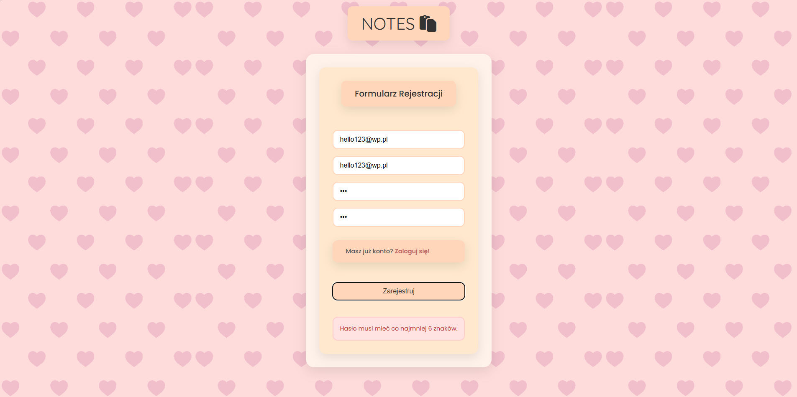
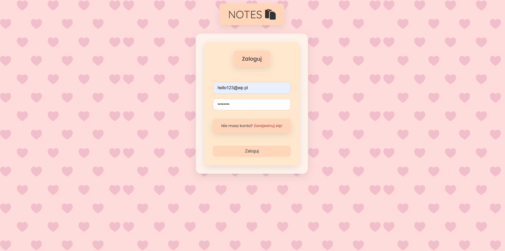
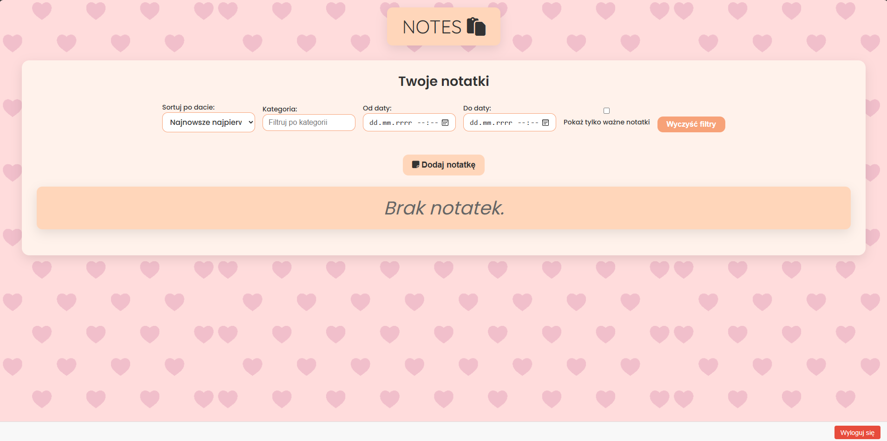
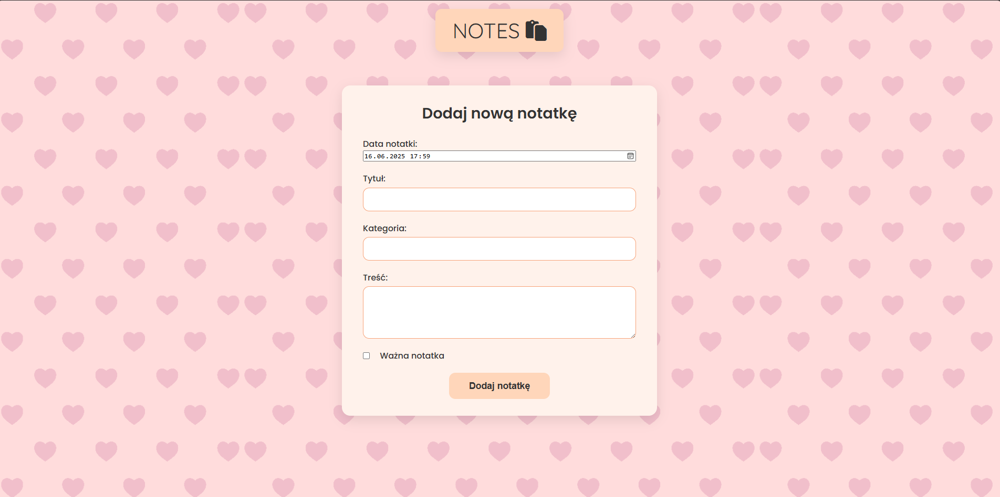
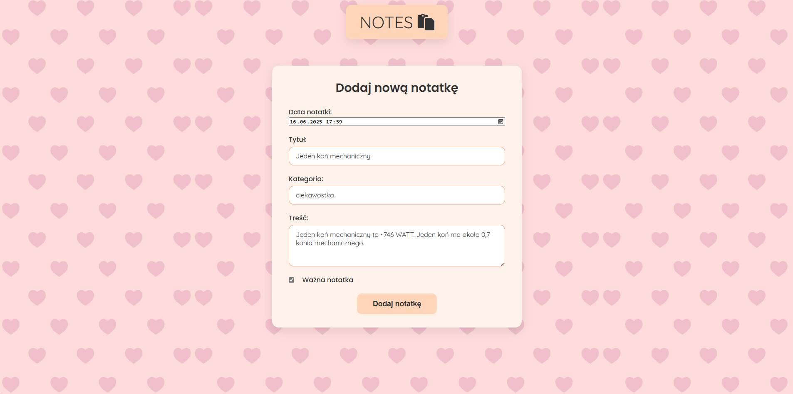
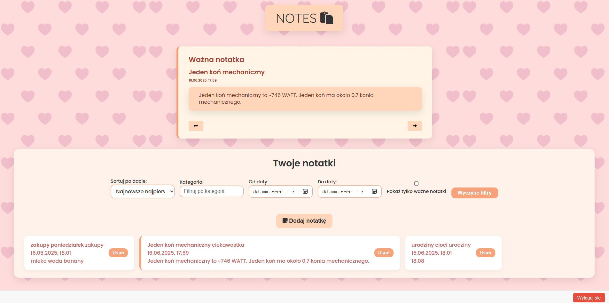
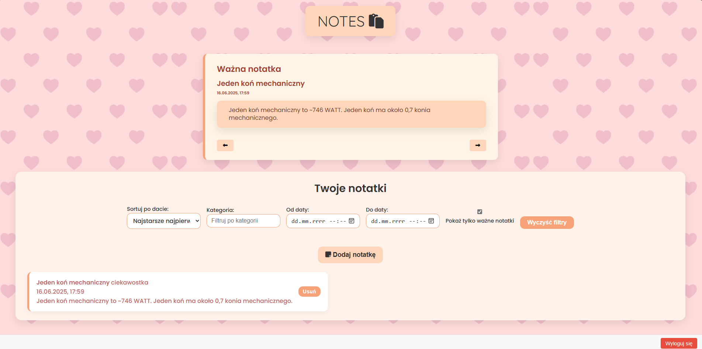

Notes App – aplikacja do notatek z Firebase
Projekt stworzony w ramach zajęć na studiach. Aplikacja webowa zbudowana w React (Vite), która umożliwia użytkownikom tworzenie i zarządzanie prywatnymi notatkami. Do obsługi logowania i bazy danych wykorzystałam Firebase (Authentication + Firestore). Aplikacja tworzona trybem 'vibe coding'

Co potrafi aplikacja?
Rejestracja konta i logowanie (z prostą walidacją)

Wyświetlanie listy notatek użytkownika (ważne notatki są wyróżnione)

Dodawanie, edytowanie i usuwanie notatek

Przeglądanie pełnej treści notatki na osobnej stronie

Filtrowanie notatek po kategorii, dacie i statusie „ważna”

Sortowanie notatek według daty

🧾 Jak wygląda notatka?
Każda notatka zawiera:

tytuł,

treść,

datę utworzenia,

informację, czy jest oznaczona jako ważna,

kategorię.

🔧 Technologie
React (Vite)

Firebase Authentication – obsługa użytkowników

Cloud Firestore – przechowywanie danych

React Router – podstrony

z
